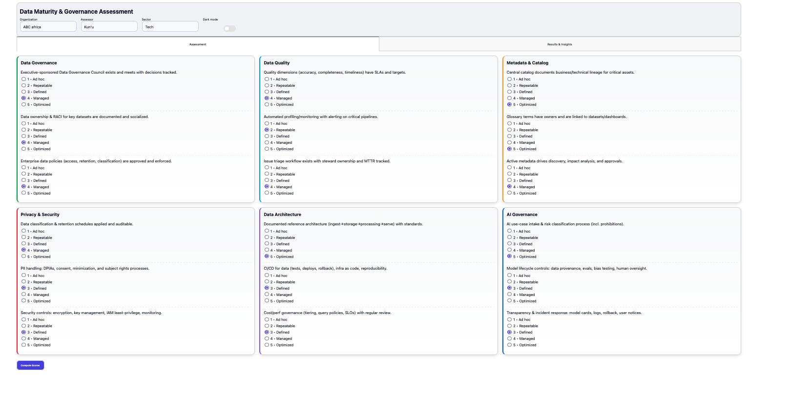
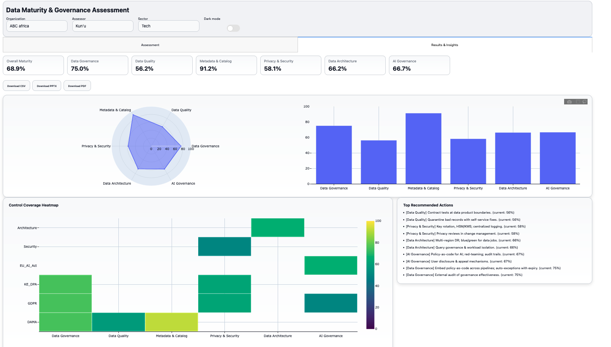

# Data Maturity & Governance Assessment (Dash)

A lightweight internal tool to assess organizational data maturity across six domains, generate exec-ready charts, and export results to CSV, PPTX, and PDF.

---

## Screenshots

**Assessment**


**Insights**


---

## Features

- Assessment with 1–5 Likert scale per question
- Theming: light/dark toggle (Boolean switch)
- KPIs + Radar + Bar + Control-Coverage Heatmap
- Top action recommendations
- One-click exports: CSV (raw), PPTX (deck), PDF (with chart images)
- Heatmap rows and question bank configured in `config.py`

---

## Quickstart (macOS)

```bash
# 1) Create & activate a venv
python3 -m venv .venv
source .venv/bin/activate

# 2) Install deps
pip install dash dash-daq pandas numpy plotly python-pptx kaleido reportlab

# 3) Run
python app.py
# App serves on http://127.0.0.1:8050/ by default
````

---

## Project Structure

```
.
├── app.py
├── config.py
├── assets/
│   ├── style.css
│   ├── 0.png          
│   └── 3.png           
└── README.md
```

---

## Configuration (`config.py`)

Tweak domains, Likert labels, the question bank, framework rows for the heatmap, and recommendations.

```python
# Domains (order drives charts)
DOMAINS = [
    "Data Governance",
    "Data Quality",
    "Metadata & Catalog",
    "Privacy & Security",
    "Data Architecture",
    "AI Governance",
]

# Likert options (1–5)
LIKERT = [
    {"label": "1 — Ad hoc", "value": 1},
    {"label": "2 — Emerging", "value": 2},
    {"label": "3 — Defined", "value": 3},
    {"label": "4 — Managed", "value": 4},
    {"label": "5 — Optimized", "value": 5},
]

# Heatmap row labels (free-text, model-agnostic)
FRAMEWORK_ROWS = [
    "Governance",
    "Quality",
    "Metadata",
    "Privacy",
    "Security",
    "Architecture",
    "AI Governance",
]

# Questions (each needs id, domain, text, weight, tags)
QUESTIONS = [
    {
      "id": "dg_policy",
      "domain": "Data Governance",
      "text": "We have an approved governance charter and operating model.",
      "weight": 1.2,
      "tags": ["Governance"],  # must include a FRAMEWORK_ROWS label to show in heatmap
    },
    # ...
]

# Recommendation catalog by domain and maturity level (1–5)
RECS = {
    "Data Governance": { 1: ["Start X", "Do Y"], 2: ["..."], 3: ["..."], 4: ["..."], 5: ["..."] },
    # ...
}
```

> **Heatmap rule:** a question contributes to a row if the row’s label (from `FRAMEWORK_ROWS`) appears in that question’s `tags`.

---

## Scoring Model (concise)

* Input: Likert 1–5 per question.
* Conversion: `percent = (value-1)/4 * 100`.
* Domain score: weighted mean of question percents in that domain.
* Overall: mean of domain scores.
* Recommendations: top items by lowest domain score, mapped via `RECS`.

---

## Exports

* **CSV:** raw responses `[id, domain, text, weight, value]`.
* **PPTX:** cover, summary, domain table, recommendations, coverage table.
* **PDF:** includes embedded chart images (requires `kaleido`), domain table, recommendations, coverage table with fixed widths.

---


## Development Tips

* Hot reload: run `app.run(debug=True)`.

